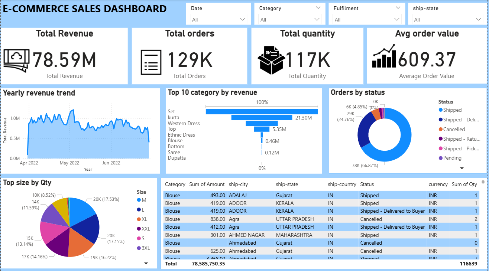

# 🛒 E-Commerce Sales Dashboard | Power BI

## 📌 Project Overview

Developed an interactive **E-Commerce Sales Dashboard** in **Power BI** to analyze sales performance, order trends, customer purchasing behavior, and regional distribution. The dashboard enables business users to monitor KPIs, filter data dynamically, and gain actionable insights for decision-making.

---

## 🚀 Key Features

* 📊 Interactive Power BI dashboard with dynamic slicers.
* 💰 Tracks Total Revenue, Total Orders, Total Quantity, and Average Order Value.
* 📈 Visualizes revenue trends over time.
* 🛍️ Identifies Top Categories by Revenue.
* 📦 Analyzes Order Status distribution.
* 👕 Displays Quantity Sold by Product Size.
* 🌍 Provides state-wise sales analysis.
* 🔎 Interactive filtering by Date, Category, Fulfillment, and Ship State.

---

## 📊 Dashboard KPIs

* **Total Revenue:** ₹78.59M
* **Total Orders:** 129K
* **Total Quantity Sold:** 117K
* **Average Order Value:** ₹609.37

---

## 📈 Dashboard Visuals

* KPI Cards
* Revenue Trend (Area Chart)
* Top Categories by Revenue (Funnel Chart)
* Order Status Distribution (Donut Chart)
* Quantity by Size (Pie Chart)
* Sales Details Table
* Interactive Slicers

---

## 🛠️ Tools & Technologies

* Power BI Desktop
* Microsoft Excel
* Power Query
* DAX (Data Analysis Expressions)

---

## 📂 Dataset Features

The dataset includes:

* Order ID
* Date
* Category
* Amount
* Quantity
* Status
* Fulfillment
* Ship City
* Ship State
* Ship Country
* Size
* Currency

---

## 📷 Dashboard Preview

### Overview Dashboard



---

## 📈 Business Insights

* Identified the highest revenue-generating product categories.
* Monitored order fulfillment and cancellation rates.
* Analyzed customer purchasing patterns across different states.
* Compared product size demand.
* Evaluated revenue trends over time.
* Built an interactive dashboard for business decision-making.

---

## 📁 Project Structure

```text
E-Commerce-Sales-Dashboard/
│ └── Ecommerce_Sales.xlsx
│ └── Ecommerce_Sales.ipynb
│
│── Images/
│   └── dashboard.png
│
│── README.md
```

---

## 🎯 Skills Demonstrated

* Data Cleaning
* Data Modeling
* DAX Measures
* Data Visualization
* Business Intelligence
* Dashboard Design
* Interactive Reporting
* Data Analysis

---

## 👩‍💻 Author

**Priyanka Ranjit Das**


These names are more searchable and attractive to recruiters than a generic repository name.
